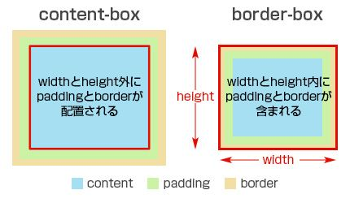
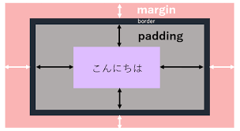

### 指導書 (全面改訂版)

<style>
.knowledge {
  background-color:rgb(230, 230, 230);
  padding: 10px;
  border-radius: 5px;
  margin-bottom: 20px;
  color: black;
  font-size: 1.2rem;
  line-height: 1.5;
  font-weight: bold;
  border: 1px solid red;
}
</style>

## ゴール：多機能Todoリストの作成

このガイドでは、HTMLとCSSを使い、最終的に以下のような多機能Todoリストの「見た目」を完成させます。

一歩ずつ、着実に進めていきましょう。

-----

## Section 0: 準備

まず、コーディングを始めるための準備をします。

1.  PCに`TodoList`など好きな名前でフォルダを作成します。
2.  VSCodeでそのフォルダを開きます。
3.  `index.html`という名前で新しいファイルを作成します。
4.  `index.html`に `!` を入力し、`Tab`キーを押してHTMLのひな形を生成します。
5.  タイトルを「多機能Todoリスト」に変更します。

```html
<!DOCTYPE html>
<html lang="ja">
<head>
    <meta charset="UTF-8">
    <meta name="viewport" content="width=device-width, initial-scale=1.0">
    <title>多機能Todoリスト</title>
</head>
<body>
    
</body>
</html>
```

✅ これで準備完了です！これ以降の作業は、すべてこのファイルの`<body>`と`<head>`内で行います。

-----

## Section 1: HTMLで骨格を作る

ページの部品を一つずつ、ゆっくりと配置していきます。

### ステップ1.1: すべてを包む「箱」を置く

<div class="knowledge">

`<div>`タグは、Webページの要素をまとめるための汎用的な「箱」です。`class`属性で名前をつけることで、後からデザインを適用しやすくなります。
</div>

`<body>`タグの中に、全体を包むコンテナ用の`div`を一つだけ追加しましょう。

```html
<body>
    <___ class="container"></___>
</body>
```

-----

**正解**

```html
<body>
    <div class="container"></div>
</body>
```

-----

### ステップ1.2: 「ヘッダー」用の箱を入れる

<div class="knowledge">

`<header>`タグは、その名の通りページの「ヘッダー部分」であることを示す、意味のある`div`のようなものです。ヘッダーとはページの上部にある特別な部分です。
</div>

先ほど作った`<div class="container">`の中に、ヘッダー用の箱を入れましょう。

```html
<div class="container">
    <___></___>
</div>
```

-----

**正解**

```html
<div class="container">
    <header></header>
</div>
```

-----

### ステップ1.3: ヘッダーに「大見出し」を入れる

<div class="knowledge">

`<h1>`タグは、ページで最も重要な「大見出し」を表します。
</div>

`<header>`の中に、`h1`タグでタイトルを入れましょう。

```html
<header>
    <___>📝 多機能Todoリスト</___>
</header>
```

-----

**正解**

```html
<header>
    <h1>📝 多機能Todoリスト</h1>
</header>
```

-----

### ステップ1.4: ヘッダーに「説明文」を入れる

<div class="knowledge">

`<p>`タグは、「段落 (Paragraph)」を表し、一般的な文章に使います。
</div>

`<h1>`タグの下に、`<p>`タグで説明文を追加しましょう。

```html
<header>
    <h1>📝 多機能Todoリスト</h1>
    <___>効率的なタスク管理で生産性を向上</___>
</header>
```


-----

**正解**

```html
<header">
    <h1>📝 多機能Todoリスト</h1>
    <p>効率的なタスク管理で生産性を向上</p>
</header>
```

✅ **中間確認**
現在の`<body>`タグの中身は以下のようになっています。

```html
<body>
    <div class="container">
        <header>
            <h1>📝 多機能Todoリスト</h1>
            <p>効率的なタスク管理で生産性を向上</p>
        </header>
    </div>
</body>
```

-----

### ステップ1.5: 「統計エリア」の箱を置く

`<header>`の次に、統計情報を表示するための新しいセクションを作ります。

<div class="knowledge">

セクションごとに`<div>`で囲むことで、ページの構造が整理され、管理しやすくなります。

</div>

先ほど作成した`<header>`タグの**下**に、`stats`というクラス名を持つ`div`を追加してください。

```html
<div class="container">
    <header>
        ...
    </header>
    <___ class="___"></___>
</div>
```

-----

**正解**

```html
<div class="container">
    <header>
        <h1>📝 多機能Todoリスト</h1>
        <p>効率的なタスク管理で生産性を向上</p>
    </header>
    <div class="stats"></div>
</div>
```

-----

### ステップ1.6: 統計エリアに「最初の項目」を入れる

`stats`エリアの中に、最初の統計項目（総タスク数）を作ります。

<div class="knowledge">

`<span>`タグは、`p`タグや`div`タグと違い、改行されないインラインのグループ化要素です。基本的に、pタグ内などのテキストの一部を強調したいときに使います
</div>

`<div class="stats">`の中に、最初の項目を入れてください。

```html
<div class="stats">
    <div class="stat">
        <span class="stat-number" id="totalTasks">＿＿＿</span>
        <div class="stat-label">＿＿＿＿＿＿</div>
    </div>
</div>
```

-----

**正解**

```html
<div class="stats">
    <div class="stat">
        <span class="stat-number" id="totalTasks">0</span>
        <div class="stat-label">総タスク数</div>
    </div>
</div>
```

今回stat-labelクラスのdivがもし、divでなくpである場合は、改行されずに横並びに表示されます。

それは、divがブロック要素と呼ばれ、必ず改行された後に表示されるものだからです。

対して、spanはインライン要素と呼ばれ、改行はされずにその場所に表示されます

今後インラインブロック要素というものも出てきます

-----

### ステップ1.7: 「繰り返し」で項目を増やす

<div class="knowledge">

コーディングでは、同じ構造をコピー＆ペーストして中身だけを変える、という作業が頻繁に発生します。
</div>

先ほど作った`<div class="stat">...</div>`をまるごとコピーし、下に3回貼り付けて、中身のテキストと`id`を完成版に合わせて変更してください。

-----

**正解**

```html
<div class="stats">
    <div class="stat">
        <span class="stat-number" id="totalTasks">0</span>
        <div class="stat-label">総タスク数</div>
    </div>
    <div class="stat">
        <span class="stat-number" id="completedTasks">0</span>
        <div class="stat-label">完了済み</div>
    </div>
    <div class="stat">
        <span class="stat-number" id="pendingTasks">0</span>
        <div class="stat-label">未完了</div>
    </div>
    <div class="stat">
        <span class="stat-number" id="completionRate">0%</span>
        <div class="stat-label">完了率</div>
    </div>
</div>
```

🚀 このように、一つずつ要素を追加し、繰り返しを使いながらHTMLを構築していきます。この後の「入力フォーム」や「タスクリスト」も、**`<div>`で箱を作る → 中に`<label>`や`<input>`を入れる → 繰り返す** という手順で作成します。

-----


### ステップ1.8: 入力セクションの箱を置く

統計エリアの次に、新しいタスクを入力するためのフォーム全体を囲むセクションを作ります。

<div class="knowledge">

`<label>`は、入力欄の項目名を示すタグです。`for`属性の値と、関連する入力要素の`id`属性の値を一致させることで、両者を関連付けます。

例えば、示されるコードでは、taskTitleというタグで一致しています。

`<input>`は、ユーザーがデータを入力するための要素です。`type`属性で入力フィールドの種類（テキスト、日付など）を指定します。

種類として、テキスト入力用の`type="text"`、日付選択用の`type="date"`、チェックボックス用の`type="checkbox"`などがあります。

またrequired属性を追加することで、必須入力項目にすることができます。

</div>

`.stats`クラスの`div`の下に、入力セクションを追加してください。まず、全体を囲む`div`、項目名を示す`label`、そして一行テキスト入力の`input`を配置します。

```html
<div class="stats">
    ...
</div>
<div class="input-section">
    <div class="input-container">
        <div class="input-group">
            <label for="taskTitle">タスク名 *</label>
            <input type="text" id="taskTitle" placeholder="新しいタスクを入力..." required>
        </div>
    </div>
</div>
```

-----

### ステップ1.9: ドロップダウンリストを追加する

<div class="knowledge">

`<select>`は、ドロップダウンリストを作成するタグです。内部に`<option>`タグを配置して、選択肢のリストを定義します。
</div>

最初の`input-group`の下に、カテゴリ選択用の新しい`input-group`と`select`要素を追記します。

```html
<div class="input-container">
    <div class="input-group">
        ...
    </div>
    <div class="input-group">
        <label for="taskCategory">カテゴリ</label>
        <select id="taskCategory">
            <option value="仕事">🏢 仕事</option>
            <option value="個人">👤 個人</option>
            <option value="学習">📚 学習</option>
            <option value="健康">💪 健康</option>
            <option value="買い物">🛒 買い物</option>
            <option value="その他">📌 その他</option>
        </select>
    </div>
</div>
```

-----

### ステップ1.10: 複数行のテキストエリアを追加する

<div class="knowledge">

`<textarea>`は、複数行のテキスト入力を可能にするタグです。`rows`属性で、表示する行数を指定します。
</div>

`.input-container`の下に、詳細説明用の`textarea`を含む新しい`input-group`を追記します。

```html
<div class="input-container">
    <div class="input-group">
        ...
        <select id="taskCategory">
            ...
        </select>
    </div>
    <div class="input-group">
        <label for="taskDescription">詳細説明</label>
        <textarea id="taskDescription" rows="3" placeholder="タスクの詳細を入力（任意）"></textarea>
    </div>
</div>
```

-----

### ステップ1.11: ボタンを追加する

<div class="knowledge">

`<button>`は、クリック可能なボタンを定義するタグです。
</div>

`textarea`を含む`input-group`の下に、タスク追加用の`button`を追記します。

```html
<div class="input-group">
    ...
</div>
<button class="btn-primary" onclick="">
    ➕ タスクを追加
</button>
```

-----


### ステップ1.12: リスト表示エリアの箱を置く

入力セクションの次に、フィルターとタスク一覧を含む、リスト表示エリア全体を囲む`div`を配置します。


`.input-section`の終了タグの下に、`todo-list`というクラス名を持つ`div`を追加してください。

```html
<div class="input-section">
    ...
</div>
<___ class="___">
</___>
```

-----

**正解**

```html
<div class="input-section">
    ...
</div>
<div class="todo-list">
</div>
```

-----

### ステップ1.13: フィルター用の箱を置く

リスト表示エリアの中に、タスクを絞り込むためのボタン群を格納する`div`を配置します。

<div class="knowledge">

`div`を入れ子にすることで、セクション内の構造をさらに細かく整理します。
</div>

先ほど作成した`.todo-list`の中に、`filters`というクラス名を持つ`div`を追加してください。

```html
<div class="todo-list">
    <___ class="__">
    </___>
</div>
```

-----

**正解**

```html
<div class="todo-list">
    <div class="filters">
    </div>
</div>
```

-----

### ステップ1.14: 最初のフィルターボタンを追加する

<div class="knowledge">

`class`属性には、スペースで区切って複数のクラス名を指定できます。
</div>

`.filters`の中に、最初のボタンを配置します。ここでは`filter-btn`と`active`という2つのクラスを指定します。

このactiveクラスは、現在選択されているフィルターボタンを示すために使用します。

```html
<div class="filters">
    <___ class="filter-btn active">すべて</___>
</div>
```

-----

**正解**

```html
<div class="filters">
    <button class="filter-btn active">すべて</button>
</div>
```

-----

### ステップ1.15: 残りのフィルターボタンを追加する

<div class="knowledge">

同じ構造の要素は、既存のコードを複製し、内容を修正することで効率的に作成します。
</div>

最初のボタンの下に、残り2つのフィルターボタンを追記してください。


```html
<div class="filters">
    <button class="filter-btn active">すべて</button>
    <button class="filter-btn">未完了</button>
    <button class="filter-btn">完了済み</button>
</div>
```

-----

### ステップ1.16: 検索ボックスを追加する

フィルターボタンの次に、タスク検索用の入力欄を配置します。

<div class="knowledge">

既存のクラスを再利用することで、スタイルの一貫性を保ちます。ここでは以前使用した`.input-group`クラスを使います。
</div>

最後の`button`の下に、`input-group`と`search-box`クラスを持つ`div`と、その中に`input`タグを追記してください。

```html
<div class="filters">
    ...
    <button class="filter-btn">完了済み</button>
    <div class="______">
        <___ type="text" id="searchInput" placeholder="🔍 タスクを検索...">
    </div>
</div>
```

-----

**正解**

```html
<div class="filters">
    ...
    <button class="filter-btn">完了済み</button>
    <div class="input-group search-box">
        <input type="text" id="searchInput" placeholder="🔍 タスクを検索...">
    </div>
</div>
```

-----

### ステップ1.17: タスク一覧表示用の箱を置く

<div class="knowledge">

`id`属性は、ページ内で一意の識別子を要素に与えます。CSSやJavaScriptから特定の要素を正確に指定するために使用します。
</div>

`.filters`の終了タグの下に、タスク一覧が実際に表示されるコンテナとして、`todo-container`という`id`を持つ`div`を追加してください。

```html
<div class="todo-list">
    <div class="filters">
        ...
    </div>
    <___ id="___">
    </___>
</div>
```

-----

**正解**

```html
<div class="todo-list">
    <div class="filters">
        ...
    </div>
    <div id="todo-container">
    </div>
</div>
```

-----

### ステップ1.18: 「タスクがない状態」の表示を作る

<div class="knowledge">

`<h3>`タグは、3番目のレベルの見出しを表します。`<h1>`より重要度が低い小見出しに使用します。
</div>

タスクが一つもない場合に表示するメッセージを、`#todo-container`の中に`div`、`h3`、`p`タグを使って作成します。

```html
<div id="todo-container">
    <div class="empty-state">
        <div style="font-size: 4em; margin-bottom: 20px;">📝</div>
        <___>タスクがありません</___>
        <___>新しいタスクを追加して始めましょう！</___>
    </div>
</div>
```

-----

**正解**

```html
<div id="todo-container">
    <div class="empty-state">
        <div style="font-size: 4em; margin-bottom: 20px;">📝</div>
        <h3>タスクがありません</h3>
        <p>新しいタスクを追加して始めましょう！</p>
    </div>
</div>
```

✅ これでHTMLの全ての骨格が完成しました。


-----

## Section 2: CSSでデザインする

HTMLの骨格ができたら、CSSで見た目を整えます。`<head>`タグの中に`<style>`タグを追加し、そこに記述していきます。

### ステップ2.1: スタイルの「おまじない」

<div class="knowledge">

`*`（アスタリスク）は、すべてのHTML要素を対象とするセレクタです。ここで全要素の余白(`margin`, `padding`)を0にリセットし、ブラウザによる表示のズレを防ぎます。

margin, paddingについてはデフォルトでゼロに設定し、各要素ごとに独自に設定するのが従うべきやり方（ベストプラクティス）です

またbox-sizingとは、要素の幅や高さを計算する際に、paddingやborderを含めるかどうかを指定するプロパティです。これを使うことで、要素のサイズをより直感的に扱うことができます。


</div>


`<head>`内に`<style>`タグを作り、以下を記述

```html
<head>
    ...
    <title>多機能Todoリスト</title>
    <style>
        * {
            margin: 0;
            padding: 0;
            box-sizing: border-box;
        }
    </>
</head>
```

-----

### ステップ2.2: 色の「変数」を定義する

<div class="knowledge">

`:root`内に`--変数名: 値;`と書くことで、CSSで使える変数を定義できます。後で`var(--変数名)`として呼び出せるため、色の管理が非常に楽になります。

また、ダークモードの作成においても、この変数の値のみを変化させれば、簡単に対応できます。
</div>

先ほどの`style`タグ内に、色を管理するための変数を定義します。

```css
<style>
    * { ... }

    :root {
        --primary-color: #667eea;
        --text-primary: #2d3748;
        --text-secondary: rgba(0, 0, 0, 0.6);
        --bg-secondary: #ffffff;
        --gradient-1: linear-gradient(135deg, #667eea 0%, #764ba2 100%);
        --border-color: #e2e8f0;
    }
</style>
```

ここでは基本的な色をカラーコードで設定しています。

色が変わる特別なデザインをlinear-gradientに作成しています。

このlinear-gradientは覚えなくてもよいです。

このような、機能がcssにはたくさんあるので、必要になったらその都度調べると良いです。

-----

### ステップ2.3: ページ全体の基本スタイル

#### ステップ2.3.1: ページ全体の基本フォントを決める

<div class="knowledge">

`font-family`は、要素内のテキストのフォント（書体）を指定します。複数をカンマ区切りで指定するのが一般的です。

`Segoe UI, sans-serif`のように書くと、「まず`Segoe UI`フォントを試してみて、もしユーザーのPCになければ、そのPCにインストールされているゴシック体（`sans-serif`）のどれかを使ってください」という意味になります。これを**フォントスタック**と呼びます。
</div>

`body`に`font-family`を追加して、ページの基本フォントを設定しましょう。

```css
body {
    font-family: 'Segoe UI', sans-serif;
}
```

-----

#### ステップ2.3.2: ページ全体の背景を設定する

<div class="knowledge">

`background`プロパティは、要素の背景を設定します。色、画像、そしてグラデーションなどを指定できます。今回は、以前`:root`で定義したグラデーションの変数`--gradient-1`を使いましょう。
</div>

`body`に`background`を追加します。

```css
body {
    font-family: 'Segoe UI', sans-serif;
    background: var(--gradient-1); /* ここを追記 */
}
```

-----

#### ステップ2.3.3: ページ全体の基本文字色を決める

<div class="knowledge">

`color`プロパティは、テキストの色を指定します。`body`に指定すると、中の子要素にもその色が引き継がれるため、ページ全体の基本の文字色を設定するのに使われます。
</div>

`body`に`color`を追加して、基本の文字色を定義した変数`--text-primary`に設定します。

```css
body {
    font-family: 'Segoe UI', sans-serif;
    background: var(--gradient-1);
    color: ___(___);
}
```

---

**正解**

```css
body {
    font-family: 'Segoe UI', sans-serif;
    background: var(--gradient-1);
    color: var(--text-primary);
}
```

-----

### ステップ2.4: コンテナの幅と配置

#### ステップ2.4.1: コンテナの最大幅を決める

<div class="knowledge">

`max-width`は、要素の**最大の横幅**を指定します。ウィンドウの幅がこれより狭い場合は要素も一緒に縮みますが、広い場合でもこの幅以上に広がることはありません。これにより、大きな画面でもデザインが崩れにくくなります。
</div>

`.container`に`max-width`を設定しましょう。

```css
.container {
    ___: 800px;
}
```

---

**正解**

```css
.container {
    max-width: 800px;
}
```

-----

#### ステップ2.4.2: コンテナを中央に配置する

<div class="knowledge">

`margin: 20px auto;`は、「上下に`20px`の余白、左右は`auto`(自動)」という意味です。`auto`を指定すると、ブラウザが利用可能な左右の余白を均等に割り振るため、結果として要素が中央に配置されます。

このmarginのように４辺あるなどで、複数の値を指定するcssプロパティがあります。

これらは指定する値の数に応じて、挙動が変わります。

値が二つの時は「上下」と「左右」、

値が４つの時は「上」、「右」、「下」、「左」 （時計回り） となります。


</div>

`.container`に`margin`を追加して中央に配置します。

```css
.container {
    max-width: 800px;
    margin: 20px auto; /* ここを追記 */
}
```

-----

#### ステップ2.4.3: コンテナの背景色を塗る

<div class="knowledge">

`background`プロパティで、要素の背景に色や画像を指定できます。今回は、以前`:root`で定義した変数`--bg-secondary`（白）を使います。
</div>

`.container`に`background`を追加します。

```css
.container {
    max-width: 800px;
    margin: 20px auto;
    ___: ___(___);
}
```

---

**正解**

```css
.container {
    max-width: 800px;
    margin: 20px auto;
    backgroud: var(--bg-secondary);
}

```


-----

#### ステップ2.4.4: コンテナの角を丸くする

<div class="knowledge">

`border-radius`は、要素の角の丸みをピクセル(`px`)単位で指定します。数値が大きいほど、角はより丸くなります。
</div>

`.container`に`border-radius`を追加して、カードのような見た目にします。

```css
.container {
    max-width: 800px;
    margin: 20px auto;
    background: var(--bg-secondary);
    border-radius: 20px;
}
```

✅ これでコンテナの基本スタイルが完成しました。

-----

### ステップ2.5: ヘッダーのスタイル


#### ステップ2.5.1: ヘッダーの内側に余白を作る

<div class="knowledge">

`padding`は、要素の**内側**の余白です。コンテンツ（文字や画像）と、その要素の枠線との間にスペースを作りたいときに使います。


</div>

`header`に`padding`を追加して、文字の周りにゆとりを持たせます。

```css
header {
    padding: 30px;
}
```

-----

#### ステップ2.5.2: ヘッダーの文字を中央揃えにする

<div class="knowledge">

`text-align: center;`は、要素内のテキストやインライン要素を水平方向の中央に揃えます。
</div>

`header`に`text-align`を追加します。

```css
header {
    padding: 30px;
    text-align: center; /* ここを追記 */
}
```

-----

#### ステップ2.5.3: ヘッダーの文字色と背景を設定する

<div class="knowledge">

`color`プロパティは、テキストの色を指定します。ここでは`white`（白）を指定し、背景には以前定義したグラデーションの変数を使います。
</div>

`header`に`color`と`background`を追加して、デザインを完成させます。

```css
header {
    padding: 30px;
    text-align: center;
    color: white; /* ここを追記 */
    background: var(--gradient-1); /* ここを追記 */
}
```


### ステップ2.6: Flexboxで統計エリアをレイアウト

統計エリアの項目を横並びに配置します。

#### ステップ2.6.1: Flexboxを有効にする

<div class="knowledge">

`display: flex;`は、要素のレイアウト方法を**「Flexbox」**に変更します。これを親要素（今回は`.stats`）に指定するだけで、その直下の子要素（`.stat`）が自動的に横並びになります。

この**Flexbox**は、要素を柔軟に配置するため、現代のWebデザインで非常に広く使われています。

</div>

`.stats`に`display: flex;`を追加しましょう。

```css
.stats {
    display: flex;
}
```

-----

#### ステップ2.6.2: 横並びの項目を均等に配置する

<div class="knowledge">

`justify-content`は、Flexboxの横方向の配置方法を指定します。`space-around`を指定すると、各項目の両側に均等なスペースが作られ、結果として項目が程よい間隔で並びます。
</div>

`.stats`に`justify-content`を追加します。

```css
.stats {
    display: flex;
    justify-content: space-around; /* ここを追記 */
}
```

-----

#### ステップ2.6.3: 統計エリア全体に余白を追加する

最後に、統計エリア全体の内側に`padding`を追加して、コンテナの端との間にスペースを作ります。

```css
.stats {
    display: flex;
    justify-content: space-around;
    padding: 20px; /* ここを追記 */
}
```

-----

### ステップ2.7: 個々の統計項目をデザイン

最後に、横並びになった個々の項目（`.stat`）をデザインします。

#### ステップ2.7.1: 各項目の背景と余白を設定する

`.stat`の各項目を白いカードのように見せるため、背景色、内側の余白、角の丸みを設定します。

```css
.stat {
    background: white;
    padding: 10px;
    border-radius: 10px;
    text-align: center;
}
```

-----

#### ステップ2.7.2: 項目に影をつけて立体感を出す

<div class="knowledge">

`box-shadow`は、要素に影をつけます。`box-shadow: X Y Blur Color;`のように指定します。

  - **X**: 水平方向のズレ（右がプラス）
  - **Y**: 垂直方向のズレ（下がプラス）
  - **Blur**: ぼかしの強さ
  - **Color**: 影の色（`rgba`を使うと透明度も指定できます）
</div>

`.stat`に薄い影をつけて、少し浮き上がっているように見せます。

```css
.stat {
    background: white;
    padding: 10px;
    border-radius: 10px;
    text-align: center;
    box-shadow: 0 2px 10px rgba(0,0,0,0.05); /* ここを追記 */
}
```

-----


### ステップ2.8: ホバー時のインタラクションを追加する

<div class="knowledge">
`:hover`は、要素にマウスカーソルが乗っている間のスタイルを定義する擬似クラスです。

`transform: translateY(Y);`は、要素をY軸（垂直方向）に移動させます。負の値は上方向への移動を示します。

</div>

`.stat`要素にマウスを乗せた時、少し上に動くように`transform`プロパティを追加します。

```css
.stat:hover {
    ___: translateY(-2px);
}
```

-----

**正解**

```css
.stat:hover {
    transform: translateY(-2px);
}
```

-----


### ステップ2.9: 変化を滑らかにする

<div class="knowledge">

`transition`は、CSSプロパティの値が変化する際のアニメーションを指定します。`all 0.2s ease`は、「すべてのプロパティの変化(all)を0.2秒かけて滑らか(ease)に実行する」という意味です。

all以外に特定のプロパティを指定することもできます。例えば、`transition: transform 0.2s ease;`のように書くと、`transform`プロパティの変化だけが対象になります。
</div>

`.stat`クラス本体に`transition`プロパティを追加し、ホバー時の動きが滑らかになるようにします。

```css
.stat {
    /* ...既存のスタイル... */
    ___: all 0.2s ease;
}
```

-----

**正解**

```css
.stat {
    /* ...既存のスタイル... */
    transition: all 0.2s ease;
    /* または transition: transform 0.2s ease; */
}
```

-----

### ステップ2.10: 統計項目の数字をスタイリングする

<div class="knowledge">

`font-weight`は、文字の太さを指定するプロパティです。`bold`や数値（例: `600`）で指定します。
文字と数値の対応は、
- `normal`: `400`
- `bold`: `700`

となります。

また、`lighter`や`bolder`を使うと、親要素のフォントウェイトに対して相対的に太さを調整できます。


</div>

`.stat-number`クラスにスタイルを適用し、数字を大きく太くします。

```css
.stat-number {
    font-size: 1.8em;
    font-weight: bold;
    color: var(--primary-color);
}
```


-----

### ステップ2.11: 数字をブロック要素にする

<div class="knowledge">

`display: block;`は、要素をブロックレベル要素として表示します。`span`のようなインライン要素に指定すると、改行され、幅や高さ、上下の`margin`が有効になります。
</div>

`.stat-number`クラスに`display: block;`を追加します。

```css
.stat-number {
    font-size: 1.8em;
    font-weight: bold;
    color: var(--primary-color);
    ___: block;
}
```

-----

**正解**

```css
.stat-number {
    font-size: 1.8em;
    font-weight: bold;
    color: var(--primary-color);
    display: block;
}
```


---


### ステップ2.12: ラベルの上に余白を作る

<div class="knowledge">
`margin-top`は、要素の上側の外側の余白を指定します。上の要素との間にスペースを作ります。
</div>

`.stat-label`クラスに`margin-top`を追加し、数字との間に少し余白を作ります。

```css
.stat-label {
    font-size: 0.9em;
    color: var(--text-secondary);
    ___: 5px;
}
```

-----

**正解**

```css
.stat-label {
    font-size: 0.9em;
    color: var(--text-secondary);
    margin-top: 5px;
}
```


-----


### ステップ2.13: プライマリボタンのスタイル

`.btn-primary`クラスに、背景色、文字色、影を追加します。

`border: none;`は、ボタンのデフォルトの枠線を消去します。

```css
.btn-primary {
    background: var(--gradient-1);
    color: white;
    box-shadow: 0 4px 15px rgba(102, 126, 234, 0.3);
    border: none;
    padding: 12px;
    border-radius: 10px;
    font-size: 1.1rem;
    width: 200px;
}
```

-----

### ステップ2.14: 入力セクションに余白を追加する


`.input-section`クラスに`padding`を追加して、セクションの内側に余白を設定してください。

```css
.input-section {
    ___: 20px;
}
```

-----

**正解**

```css
.input-section {
    padding: 20px;
}
```

-----

### ステップ2.15: 入力欄コンテナをFlexboxにする

\<div class="knowledge"\>

`display: flex;`は、要素のレイアウト方法をFlexboxに変更します。子要素を柔軟に配置するために使用します。
\</div\>

`.input-container`クラスでFlexboxレイアウトを有効にしてください。

```css
.input-container {
    ___: ___;
}
```

-----

**正解**

```css
.input-container {
    display: flex;
}
```

-----

### ステップ2.16: Flexboxのアイテムを縦に並べる

\<div class="knowledge"\>
`flex-direction`は、Flexboxの主軸の方向を指定するプロパティです。`column`を指定すると、子要素が縦方向に配置されます。
\</div\>

`.input-container`に`で入力欄のグループが縦に並ぶようにしてください。

```css
.input-container {
    display: flex;
    ___: ___;
}
```

-----

**正解**

```css
.input-container {
    display: flex;
    flex-direction: column;
}
```

-----

### ステップ2.17: アイテム間の間隔を設定する

\<div class="knowledge"\>

`gap`は、FlexboxやGridレイアウトのアイテム間の間隔を指定するプロパティです。
\</div\>

`.input-container`に`gap`を追加して、各入力欄グループの間に`15px`の間隔を設定してください。

```css
.input-container {
    display: flex;
    flex-direction: column;
    ___: ___;
}
```

-----

**正解**

```css
.input-container {
    display: flex;
    flex-direction: column;
    gap: 15px;
}
```

-----


### ステップ2.18: フォーム入力欄の共通スタイル

<div class="knowledge">

セレクタをカンマ（`,`）で区切ると、複数の要素に同じスタイルを一度に適用できます。
</div>

`input`, `select`, `textarea`の全てに共通するスタイルを定義します。

ここでは、復習として、widthは親要素の横幅と同じにし、角丸を10pxで指定してみてください。

```css
input, select, textarea {
    width: ___;
    padding: 12px 15px;
    border: 2px solid var(--border-color);
    ___: 10px;
}
```

-----

**正解**

```css
input, select, textarea {
    width: 100%;
    padding: 12px 15px;
    border: 2px solid var(--border-color);
    border-radius: 10px;
}
```

-----

### ステップ2.19: フォーカス時のスタイル

<div class="knowledge">
`:focus`は、要素がフォーカス（クリックされたり、Tabキーで選択されたり）されている間のスタイルを定義する擬似クラスです。

`outline: none;`は、フォーカス時にブラウザがデフォルトで表示する枠線（アウトライン）を非表示にします。

</div>

入力欄がフォーカスされた時に、枠線の色を変え、影をつけるスタイルを定義します。

```css
input:___, select:___, textarea:___ {
    outline: none;
    border-color: var(--primary-color);
    box-shadow: 0 0 0 3px rgba(102, 126, 234, 0.1);
}
```

-----

**正解**

```css
input:focus, select:focus, textarea:focus {
    outline: none;
    border-color: var(--primary-color);
    box-shadow: 0 0 0 3px rgba(102, 126, 234, 0.1);
}
```

-----


### ステップ2.20: フィルターエリアのレイアウト

`.filters`クラスにFlexboxと、アイテム間の間隔を10pxに設定して、フィルターボタンと検索ボックスを横に並べられるようにします。

```css
.filters {
    ___: ___;
    ___: 10px;
    align-items: center;
    margin-bottom: 15px;
}
```

-----

**正解**

```css
.filters {
    display: flex;
    gap: 10px;
    align-items: center;
    margin-bottom: 15px;
}
```

-----

### ステップ2.21: フィルターボタンの基本スタイル

\<div class="knowledge"\>

`cursor: pointer;`は、要素にマウスを乗せた時のカーソルの形状を、クリック可能であることを示す指の形に変更します。
\</div\>

`.filter-btn`クラスにスタイルを適用してください。

```css
.filter-btn {
    padding: 8px 12px;
    border: none;
    border-radius: 5px;
    ___: pointer;
    background: #e2e8f0;
    color: var(--text-primary);
}
```

-----

**正解**

```css
.filter-btn {
    padding: 8px 12px;
    border: none;
    border-radius: 5px;
    cursor: pointer;
    background: #e2e8f0;
    color: var(--text-primary);
}
```

-----

### ステップ2.22: アクティブなフィルターボタンのスタイル

\<div class="knowledge"\>

`.class1 .class2`のようにクラス名を繋げて記述するセレクタは、「class1とclass2の両方を持つ要素」を指定します。
\</div\>

`.filter-btn.active`セレクタにスタイルを適用し、選択されているボタン文字色をを白色にしてください。

```css
.filter-btn.active {
    background: var(--primary-color);
    color: ___;
}
```

-----

**正解**

```css
.filter-btn.active {
    background: var(--primary-color);
    color: white;
}
```

-----

### ステップ2.23: 検索ボックスの幅を可変にする

\<div class="knowledge"\>

`flex: 1;`は、Flexboxのアイテムが、コンテナ内の余ったスペースをすべて埋めるように伸長することを指定します。
\</div\>

`.search-box`クラスに`flex: 1;`を追加して、検索ボックスがフィルターエリアの残りの幅をすべて使用するようにしてください。

```css
.search-box {
    ___: 1;
}
```

-----

**正解**

```css
.search-box {
    flex: 1;
}
```

-----

### ステップ2.24: タスクがない状態の表示を整える

\<div class="knowledge"\>

`min-height`は、要素の最小の高さを指定します。コンテンツがなくても、この高さが確保されます。
\</div\>

`#todo-container`に最小の高さを設定し、`.empty-state`にスタイルを適用して、メッセージを中央に表示してください。

```css
#todo-container {
    ___: 200px;
}
.empty-state {
    text-align: center;
    color: var(--text-secondary);
    padding: 40px;
}
```

-----

**正解**

```css
#todo-container {
    min-height: 200px;
}
.empty-state {
    text-align: center;
    color: var(--text-secondary);
    padding: 40px;
}
```


✅ これで主要なコンポーネントのスタイリングが完了しました。残りの細かいスタイルは、最終コードで確認し、同様の手順で一つずつ適用していくことで完成させることができます。


-----

**完成版コード**


```html

<!DOCTYPE html>
<html lang="ja">
  <head>
    <meta charset="UTF-8" />
    <meta name="viewport" content="width=device-width, initial-scale=1.0" />
    <title>多機能Todoリスト</title>
    <style>
      * {
        margin: 0;
        padding: 0;
        box-sizing: border-box;
      }
      :root {
        --primary-color: #667eea;
        --text-primary: #2d3748;
        --text-secondary: rgba(0, 0, 0, 0.6);
        --bg-secondary: #ffffff;
        --gradient-1: linear-gradient(135deg, #667eea 0%, #764ba2 100%);
        --border-color: #e2e8f0;
      }
      body {
        font-family: "Segoe UI", sans-serif;
        background: var(--gradient-1);
        color: var(--text-primary);
      }
      .container {
        max-width: 800px;
        margin: 20px auto;
        background: var(--bg-secondary);
        border-radius: 20px;
      }
      header {
        padding: 30px;
        text-align: center;
        color: white;
        background: var(--gradient-1);
      }
      .stats {
        display: flex;
        justify-content: space-around;
        padding: 20px;
      }
      .stat {
        background: white;
        padding: 10px;
        border-radius: 10px;
        text-align: center;
        box-shadow: 0 2px 10px rgba(0, 0, 0, 0.05);
        transition: all 0.2s ease;
      }
      .stat:hover {
        transform: translateY(-2px);
      }
      .stat-number {
        font-size: 1.8em;
        font-weight: bold;
        color: var(--primary-color);
        display: block;
      }
      .stat-label {
        font-size: 0.9em;
        color: var(--text-secondary);
        margin-top: 5px;
      }
      .input-section {
        padding: 20px;
      }
      .input-container {
        display: flex;
        flex-direction: column;
        gap: 15px;
      }
      .input-group {
        display: flex;
        flex-direction: column;
      }
      input,
      select,
      textarea {
        width: 100%;
        padding: 12px 15px;
        border: 2px solid var(--border-color);
        border-radius: 10px;
      }
      input:focus,
      select:focus,
      textarea:focus {
        outline: none;
        border-color: var(--primary-color);
        box-shadow: 0 0 0 3px rgba(102, 126, 234, 0.1);
      }
      .btn-primary {
        background: var(--gradient-1);
        color: white;
        box-shadow: 0 4px 15px rgba(102, 126, 234, 0.3);
        border: none;
        padding: 12px;
        border-radius: 10px;
        font-size: 1.1rem;
        width: 200px;
      }
      .todo-list {
        padding: 20px;
      }
      .filters {
        display: flex;
        gap: 10px;
        align-items: center;
        margin-bottom: 15px;
      }
      .filter-btn {
        padding: 8px 12px;
        border: none;
        border-radius: 5px;
        cursor: pointer;
        background: #e2e8f0;
        color: var(--text-primary);
      }
      .filter-btn.active {
        background: var(--primary-color);
        color: white;
      }
      .search-box {
        flex: 1;
      }
      .search-box input {
        width: 100%;
      }
      #todo-container {
        min-height: 200px;
      }
      .empty-state {
        text-align: center;
        color: var(--text-secondary);
        padding: 40px;
      }
    </style>
  </head>
  <body>
    <div class="container">
      <header>
        <h1>📝 多機能Todoリスト</h1>
        <p>効率的なタスク管理で生産性を向上</p>
      </header>
      <div class="stats">
        <div class="stat">
          <span class="stat-number" id="totalTasks">0</span>
          <div class="stat-label">総タスク数</div>
        </div>
        <div class="stat">
          <span class="stat-number" id="completedTasks">0</span>
          <div class="stat-label">完了済み</div>
        </div>
        <div class="stat">
          <span class="stat-number" id="pendingTasks">0</span>
          <div class="stat-label">未完了</div>
        </div>
        <div class="stat">
          <span class="stat-number" id="completionRate">0%</span>
          <div class="stat-label">完了率</div>
        </div>
      </div>
      <div class="input-section">
        <div class="input-container">
          <div class="input-group">
            <label for="taskTitle">タスク名 *</label>
            <input type="text" id="taskTitle" placeholder="新しいタスクを入力..." required />
          </div>
          <div class="input-group">
            <label for="taskCategory">カテゴリ</label>
            <select id="taskCategory">
              <option value="仕事">🏢 仕事</option>
              <option value="個人">👤 個人</option>
              <option value="学習">📚 学習</option>
              <option value="健康">💪 健康</option>
              <option value="買い物">🛒 買い物</option>
              <option value="その他">📌 その他</option>
            </select>
          </div>
          <div class="input-group">
            <label for="taskDescription">詳細説明</label>
            <textarea id="taskDescription" rows="3" placeholder="タスクの詳細を入力（任意）"></textarea>
          </div>
          <button class="btn-primary">➕ タスクを追加</button>
        </div>
      </div>
      <div class="todo-list">
        <div class="filters">
          <button class="filter-btn active">すべて</button>
          <button class="filter-btn">未完了</button>
          <button class="filter-btn">完了済み</button>
          <div class="input-group search-box">
            <input type="text" id="searchInput" placeholder="🔍 タスクを検索..." />
          </div>
        </div>
        <div id="todo-container">
          <div class="empty-state">
            <div style="font-size: 4em; margin-bottom: 20px">📝</div>
            <h3>タスクがありません</h3>
            <p>新しいタスクを追加して始めましょう！</p>
          </div>
        </div>
      </div>
    </div>
  </body>
</html>


```