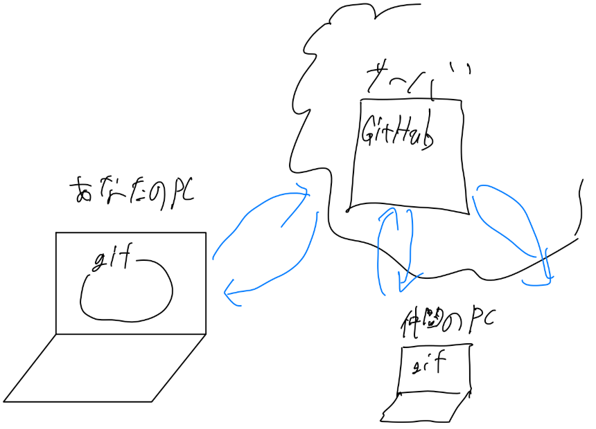

# Git/GitHub講座

---

## 導入

Gitとは
> チームで開発するときに、プログラムコードを共有し、バージョンを管理するためのツール

GitHubとは
> Gitを使って、コードをオンラインで保存・共有するためのサービス

---

#### 全体イメージ

<!--  -->
<image src="image.png" width='700px' style="margin:auto;display:block">

---

#### Gitを用いた開発手順の全体像

<image src="image-1.png" width='900px' style="margin:auto;display:block">

---

## 必ず覚える用語1

### リポジトリ（Repository）

gitの中にコードやファイルを保存する場所。すべての開発者のPCの中に存在する（ローカルリポジトリ）。また、サーバー、GitHub上にも存在する（リモートリポジトリ）。

---
## 必ず覚える用語2

### コミット（Commit）

変更をリポジトリに保存すること。変更内容に対する説明を付けることができる。この操作をすることで、Gitがファイルの変更を認知することが出きる。**忘れないように注意**

---
## 必ず覚える用語3

### プッシュ（Push）

ローカルリポジトリの変更をリモートリポジトリに反映すること。GitHub上のコードを更新する。つまり、**アップロード**的な操作

---

## 必ず覚える用語4

### プル（Pull）

リモートリポジトリの変更をローカルリポジトリに反映すること。GitHub上のコードをダウンロードする。つまり、**ダウンロード&インストール**的な操作

---

#### 開発手順イメージの再掲

<image src="image-1.png" width='900px' style="margin:auto;display:block">

---

## 具体的な開発手順

### 1. 最初だけの初期化(一人だけがやる)
   1. ローカルリポジトリを作成(あなたのPCに)
   1. リモートリポジトリを作成(GitHub上に)

---

### 2. 開発の手順
   1. (ほかのメンバーの別のPCで最初に)リモートリポジトリをクローン(Clone)（GitHub上のコードをPCにダウンロードして初期化）
   1. リモートリポジトリをプル(Pull)（GitHub上のコードをPCにダウンロードして更新）
   1. コードを編集して、保存(UnityやVSCode上で)
   1. **コミット(Commit)（変更内容をGitに保存）**
   1. プッシュ(Push)（変更内容をGitHub上にアップロード）

---

## 演習：ペアで自己紹介ファイル作成

### 目標
- Git/GitHubの基本的な開発手順を体験
- 2人1組でお互いの自己紹介ファイルを作成
- コンフリクト（衝突）の解決も体験

---

### 演習の準備

#### ペア編成
- 2人1組でペアを作る
- 1人が**リーダー**、もう1人が**メンバー**になる

#### 使用ツール
- **VS Code** (エディタ統合で便利)
(GitHub Desktopも可能であるが、面倒くさい)

---

## 演習手順 1/4：初期化（メンバーのPCとリモートに作成）

ペアプログラミング: リーダーがメンバーに操作を指示し、メンバーが操作をする

1. **VSCode上でローカルリポジトリの作成**
   1. 新しいフォルダ `self-introduction-project` を作成
   1. 「Initialize Repository」をクリック(あなたの PCでローカルリポジトリの作成)
2. **リモートリポジトリの作成**
   1. 「Publish Branch」から、「public repository」として...(GitHub上でリモートリポジトリの作成)

---

## 演習手順 2/4：クローン（リーダーのPCにクローン&プル、ダウンロード）

1. **リポジトリをクローン**
   - リーダーからリポジトリのURLを教えてもらう
   - 自分のPCにクローンする

GitHub Desktop の場合：`File` → `Clone repository` → `URL` タブ

VS Code の場合：`Ctrl+Shift+P` → `Git: Clone`

---

## 演習手順 3/4：リーダーのPCでファイル作成

1. **自己紹介ファイルを作成**
   - ファイル名：`profile1.txt`
   - 好きな内容で記入
   - 例：名前、趣味、好きな食べ物など
2. **コミット＆プッシュ**

---

## 演習手順 4/4：メンバーのPCでプルとファイル作成

1. **プル(Pull)**
   - リーダーの変更をダウンロード
2. **自己紹介ファイルを作成**
   - ファイル名：`profile2.txt`
   - 同様の形式で自己紹介を記入
3. **コミット＆プッシュ**

---

### GUI操作のポイント

#### GitHub Desktop
- 変更ファイルは左側に表示
- コミットメッセージを下部に入力
- `Commit to main` → `Push origin`

#### VS Code
- Source Control パネル（Ctrl+Shift+G）
- 変更ファイルの `+` でステージング
- メッセージ入力後 `✓` でコミット
- `...` → `Push` でプッシュ

---

## 発展(コンフリクト)

### 両方の作業（意図的にコンフリクトを発生）
1. **README.mdファイルを作成**
   - 同じファイル名で同時に作業
   - リーダー：プロジェクト概要を記入
   - メンバー：メンバー紹介を記入
2. **コミット＆プッシュを試行**
   - どちらかがコンフリクトエラーになる

---

## 演習手順 6/6：コンフリクト解決

### コンフリクト解決の体験
1. **エラーが出た人の作業**
   - プル操作を実行
   - コンフリクトマーカーを確認
   - 手動でファイルを編集して解決
2. **解決後の操作**
   - コミット＆プッシュ

---

## 振り返り

### 体験したこと
- ✅ リポジトリの作成・クローン
- ✅ ファイルの作成・編集
- ✅ コミット・プッシュ・プル
- ✅ コンフリクトの解決

---

## 振り返り
### 実際の開発で重要なポイント
- **こまめなコミット**で変更を記録
- **プル**を忘れずに最新状態を維持
- **コンフリクト**は恐れずに冷静に対処

